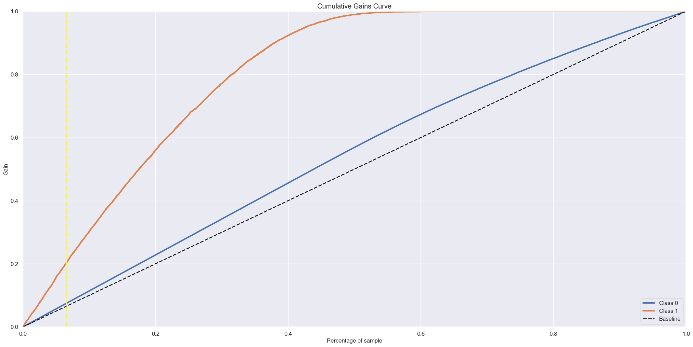

# Green Shield - Health and Car Insurance

**Aviso:** O seguinte contexto é completamente fictício, a empresa, o contexto, o CEO e as questões de negócios.

A Green Shield é uma empresa que oferece seguro saúde para seus clientes e a equipe de produtos está analisando a possibilidade de oferecer aos segurados um novo produto: o seguro de automóveis.

Uma empresa de seguros que oferece seguro de saúde, contudo, a empresa está a fim de desenvolver um novo produto, no caso um seguro de carros. Contudo, o time de produtos está a fim de decidir se é viável ou não desenvolver esse novo produto para a empresa, o quanto esse produto traria de renda e para quais pessoas oferecer. Com a base de dados em mãos, foi realizada uma pesquisa entre as pessoas que já possuíam um seguro e se elas comprariam este novo produto. Contudo, existem novos clientes que não participaram desta pesquisa, e o time de produto gostaria de oferecer este novo produto para novos clientes. Com base nisso, o time de produto sugeriu a contratação de um cientista de dados para poder ser feita uma análise a fim de responder se essas novas pessoas comprariam o seguro de automóvel ou não.

A campanha existe um limite de pessoas. A campanha pelo time de produto foi decidida que seria feita apenas por ligação telefônica, assim passando uma lista para o time de comercial, ligando e oferecendo o novo produto. Porém, o time comercial possui uma capacidade de apenas 2.000 ligações e sua lista de potenciais clientes é atualmente de 127.000 pessoas que podem receber essas ligações telefônicas.

# Problema de Negócio

Como resultado de sua contratação e consultoria, você precisará entregar um relatório contendo análises e respostas para as seguintes perguntas:

- Os principais insights sobre os atributos relevantes de clientes interessados em adquirir seguro de automóveis.

- Que porcentagem de clientes interessados em comprar o seguro de automóveis o time do comercial (vendas) irá atingir com apenas 2.000 ligações?

- Caso a capacidade do time do comercial dobre, que pocentagem de potenciais clientes interessadas em adquirir o seguro de automóveis?

- Quantas ligações o time do comercial precisa realizar para contatar 80% dos clientes interessados em adquirir o novo produto?

# Planejamento da Solução

## Qual é a solução?
É necessário desenvolver um modelo de aprendizado de máquina que classifique os clientes com base em sua probabilidade de aquisição de seguro de veículos.

## Como será a solução?
Este Modelo estará disponível em uma API, podendo ser utilizado pelo cliente a qualquer momento que ele precise.

# Estratégia da Solução:

**Etapa 01. Descrição dos dados:** Meu objetivo é usar métricas estatísticas para identificar dados fora do escopo do negócio.

**Etapa 02. Feature Engineering:** Derive novos atributos com base nas variáveis originais para descrever melhor o fenômeno que será modelado.

**Passo 03. Filtragem de Dados:** Filtre linhas e selecione colunas que não contenham informações para modelagem ou que não correspondam ao escopo do negócio.

**Etapa 04. Análise exploratória de dados:** Explore os dados para encontrar insights e entender melhor o impacto das variáveis no aprendizado do modelo.

**Etapa 05. Preparação dos dados:** Prepare os dados para que os modelos de aprendizado de máquina possam aprender o comportamento específico.

**Etapa 06. Seleção de recursos:** Seleção dos atributos mais significativos para treinar o modelo.

**Etapa 07. Machine Learning Modelling:** treinamento do modelo de aprendizado de máquina

**Etapa 08. Conversão do desempenho do modelo em valores de negócios:** Converta o desempenho do modelo em um resultado de negócios.

**Etapa 09. Deploy Model to Production:** Publique o modelo em um ambiente de nuvem para que outras pessoas ou serviços possam usar os resultados para melhorar a decisão de negócios.

#  Modelos de Machine Learning aplicados
Os Testes foram realizados usando os seguintes algoritmos:

**KNN Classifier**

**Logistic Regression**

**Gaussian Naive Bayes**

**Random Forest**

**Gradient Boosting Machines**

**XGBoost Classifier**

**Light Gradient Boosting Machine Classifier**

##  Performance dos Modelos

**Real Performance - Cross Validation**

| Model Name |Accuracy Mean | Precision Mean | Precision STD | Recall Mean | Recall STD | Precision@K Mean | Precision@K STD | Recall@K Mean | Recall@K STD |
|------------|--------------|-----------------|--------------|-------------|------------|------------------|-----------------|---------------|--------------|
GaussianNB|	0.7676|	0.6660|	0.0019|	0.9773|	0.0003|	0.7344|	0.0020|	0.4137|	0.0011|
KNeighborsClassifier|	0.8427|	0.7609|	0.0022|	0.9521|	0.0009|	0.8843|	0.0025|	0.4982|	0.0014|
GradientBoostingClassifier|	0.8236|	0.7470|	0.0016|	0.9234|	0.0014|	0.9230|	0.0033|	0.5200|	0.0019|
RandomForestClassifier|	0.7828|	0.7014|	0.0022|	0.9066|	0.0016|	0.7993|	0.0040|	0.4503|	0.0022|
LogisticRegression|	0.7835|	0.7071|	0.0017|	0.8915|	0.0018|	0.7520|	0.0039|	0.4237|	0.0022|
LGBMClassifier|	0.9095|	0.9572|	0.0013|	0.8377|	0.0024|	1.0000|	0.0000|	0.5634|	0.0000|
XGBClassifier|	0.8755|	0.8827|	0.0034|	0.8365|	0.0023|	0.9997|	0.0002|	0.5632|	0.0001|

## Modelo Final
Ao final dos testes realizados o Modelo **Light Gradient Boosting Machine Classifier** foi selecionado como modelo final, devido a sua alta performance e também
pelo tamanho reduzido.

# Conversão do desempenho do modelo em valores de negócios

## Que porcentagem de clientes interessados em comprar seguro de automóveis a equipe de vendas poderá atingir com 2.000 ligações?
Ao utilizar 3,28% dos dados de validação, 2 mil ligações da equipe de vendas, o modelo seria capaz de identificar 10,14% de pessoas interessadas em adquirir o seguro.

## E se a capacidade da equipe de vendas aumentar para 4.000 chamadas?
Ao utilizar 6,56% dos dados de validação, 2 mil ligações da equipe de vendas, o modelo seria capaz de identificar 20,38% de pessoas interessadas em adquirir o seguro.

# Quantas ligações a equipe de vendas precisa fazer para contatar 80% dos clientes interessados em adquirir seguro de automóveis?
Para atingir 80% dos clientes interessados seriam necessárias pelo menos 19250 ligações.

                      
#  Conclusão
Ao Final deste projeto foi possivel compreender o fenômeno Learning to Rank (LTR) e como é utilizada usada para aperfeiçoar os resultados da pesquisa com base em coisas como padrões de uso reais. Existem três abordagens para LTR sendo elas Pointwise, Listwise e Pairwise (utilizada neste projeto).

Abordagens de Pairwise examinam dois documentos juntos. Eles também usam classificação ou regressão - para decidir qual dos pares tem melhor classificação.
Comparamos este par superior-inferior com a verdade básica e ajustamos a classificação se não corresponder. O objetivo é minimizar o número de casos em que o par de resultados está na ordem errada em relação à verdade fundamental.

Outro ponto interessante foram as métricas diferenciadas para este tipo de metodologia, onde se utilizam as denominadas metricas @K/atK, diferente das métricas de avaliação padrões, as métricas TOPK (@K/atK) estão interessados em ranquear os N itens principais. Portanto, faz mais sentido calcular a precisão e recuperar as métricas nos primeiros N itens em vez de em todos os itens. Assim, a noção de precisão e rechamada em k, onde k é um número inteiro definível pelo avaliador para corresponder ao objetivo das N recomendações principais.

#  Próximos Passos

Iniciar mais um ciclo para analisar o problema buscando abordagens diferentes, tendo em vista principalmente o desbalanceamento do conjunto de dados e overfitting.

Possíveis pontos para serem abordados no segundo ciclo:

-**Aprofundamento em derivações de features**

-**Rescaling e Encode dos dados com metodologias diferentes**

-**Trabalhar com novas Features para treinar o modelo**

-**Trabalhar com um método mais robusto para achar os melhores Hyperparametros para o modelo**
